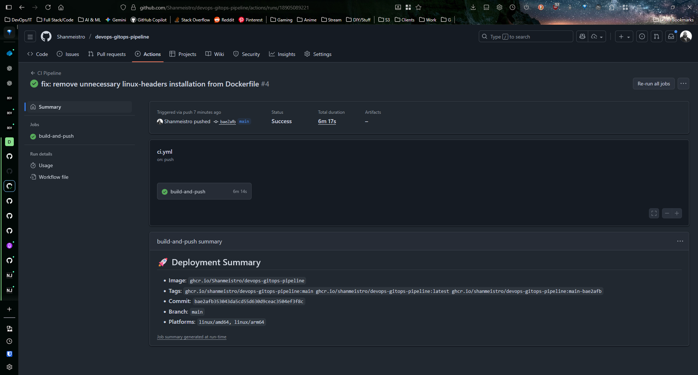

# 🚀 DevOps GitOps Pipeline

[](https://github.com/Shanmeistro/devops-gitops-pipeline/releases)
[](./LICENSE)


This repository contains the **application source code and CI/CD pipeline** for a comprehensive GitOps deployment demonstration using **GitHub Actions**, **ArgoCD**, and **Kubernetes**.

> **Note**: This repository focuses on the application and CI/CD pipeline. The Kubernetes manifests and infrastructure configuration are maintained in the separate [devops-gitops-infra](https://github.com/Shanmeistro/devops-gitops-infra) repository.

## 🚀 Features

### Application
- **Modern Flask Web Application** with responsive Bootstrap UI
- **Real-time System Monitoring** dashboard with live metrics
- **Prometheus Metrics Integration** for observability
- **Health Check Endpoints** for Kubernetes probes
- **Production-ready Configuration** with Gunicorn WSGI server

### CI/CD Pipeline
- **Multi-platform Docker builds** (AMD64/ARM64)
- **Semantic versioning** with Git SHA tagging
- **GitHub Container Registry** (GHCR) integration
- **Build optimization** with multi-stage Dockerfile
- **Security best practices** with non-root containers

### Monitoring & Observability
- **Prometheus metrics** endpoint (`/metrics`)
- **Health checks** (`/health`, `/ready`)
- **System statistics** API (`/api/stats`)
- **Real-time dashboard** with auto-refresh

## 🏗 Architecture


## 🎬 Demo

### Successful GitOps Deployment

The following screenshots demonstrate the complete GitOps workflow in action:

#### ArgoCD UI

*ArgoCD web interface showing application sync status*

#### ArgoCD Deployment

*ArgoCD deployment details for the application*

#### CI Pipeline Build & Push

*GitHub Actions workflow building and pushing Docker images*

#### Cluster & Node Info

*Kubernetes cluster and node information*

#### Cluster Configuration

*Kubernetes cluster configuration overview*

#### Grafana Dashboard

*Grafana dashboard visualizing application metrics*

## 🛠 Tech Stack

- **Application**: Python Flask, Bootstrap 5, Prometheus Client
- **Containerization**: Docker (multi-stage builds)
- **CI/CD**: GitHub Actions
- **Registry**: GitHub Container Registry (GHCR)
- **Orchestration**: Kubernetes
- **GitOps**: ArgoCD
- **Monitoring**: Prometheus + Grafana

## 🎯 API Endpoints

| Endpoint | Description | Purpose |
|----------|-------------|---------|
| `/` | Dashboard homepage | User interface with real-time metrics |
| `/health` | Health check | Kubernetes liveness probe |
| `/ready` | Readiness check | Kubernetes readiness probe |
| `/metrics` | Prometheus metrics | Observability and monitoring |
| `/version` | Build information | Version tracking and debugging |
| `/api/stats` | System statistics | Real-time dashboard data |

## 🔄 CI/CD Workflow

1. **Code Push** → Triggers GitHub Actions workflow
2. **Build Stage** → Multi-platform Docker image creation
3. **Security Scan** → Container vulnerability assessment
4. **Registry Push** → Image published to GHCR with semantic tags
5. **GitOps Trigger** → ArgoCD detects new image (via infra repo)
6. **Deployment** → Kubernetes automatically deploys latest version
7. **Health Check** → Application validates successful deployment

## 🏃‍♂️ Quick Start

### Local Development

```bash
# Clone the repository
git clone git@github.com:Shanmeistro/devops-gitops-pipeline.git
cd devops-gitops-pipeline

# Install dependencies
pip install -r src/requirements.txt

# Run the application
cd src
python app.py

# Access the dashboard
open http://localhost:8080
```

### Docker Development

```bash
# Build the image
docker build -t devops-demo .

# Run the container
docker run -p 8080:8080 devops-demo

# Access the dashboard
open http://localhost:8080
```

### ArgoCD Setup (Local)

```bash
# Install ArgoCD
kubectl create namespace argocd
kubectl apply -n argocd -f https://raw.githubusercontent.com/argoproj/argo-cd/stable/manifests/install.yaml

# Expose ArgoCD UI
kubectl port-forward svc/argocd-server -n argocd 8080:443

# Get admin password
kubectl -n argocd get secret argocd-initial-admin-secret -o jsonpath="{.data.password}" | base64 -d
```

## 📊 Monitoring & Observability

### Prometheus Metrics
The application exposes metrics at `/metrics` including:
- HTTP request duration and count
- System resource usage (CPU, memory, disk)
- Application-specific counters
- Custom business metrics

### Health Checks
- **Liveness**: `/health` - Application health status
- **Readiness**: `/ready` - Ready to receive traffic
- **Startup**: Configurable startup probe support

### Dashboard Features
- Real-time system metrics visualization
- Request counting and performance tracking
- Version and build information display
- Auto-refreshing statistics

## 🔧 Configuration

### Environment Variables

| Variable | Description | Default |
|----------|-------------|---------|
| `APP_VERSION` | Application version | `dev` |
| `BUILD_TIME` | Build timestamp | Current time |
| `COMMIT_SHA` | Git commit hash | `unknown` |
| `ENVIRONMENT` | Deployment environment | `development` |
| `PORT` | Application port | `8080` |
| `DEBUG` | Debug mode | `False` |

### Build Arguments (Docker)

```dockerfile
--build-arg APP_VERSION=v1.0.0
--build-arg BUILD_TIME=2024-01-01T00:00:00Z
--build-arg COMMIT_SHA=abc123def456
```

## 🤝 Related Repositories

- **Infrastructure**: [devops-gitops-infra](https://github.com/Shanmeistro/devops-gitops-infra) - Kubernetes manifests, ArgoCD configuration, and monitoring setup

## 📝 License

This project is licensed under the MIT License - see the [LICENSE](LICENSE) file for details.

## 🎯 Portfolio Highlights

This project demonstrates:
- ✅ **Modern Web Development** with responsive UI design
- ✅ **Containerization Best Practices** with security and optimization
- ✅ **CI/CD Pipeline Design** with automated testing and deployment
- ✅ **GitOps Methodology** with infrastructure separation
- ✅ **Observability Implementation** with metrics and monitoring
- ✅ **Production Readiness** with health checks and scaling considerations
- ✅ **Cloud-Native Architecture** following 12-factor app principles

## 🏷️ Tagging Convention

This project follows [Conventional Commits](https://www.conventionalcommits.org/en/v1.0.0/):

| Prefix | Meaning |
|--------|----------|
| `feat:` | New feature |
| `fix:`  | Bug fix |
| `chore:` | Non-functional update |
| `docs:` | Documentation only |
| `ci:` | CI/CD or workflow changes |

To create a new release tag:
```bash
./scripts/tag-release.sh
```

DevOps Commit Routine example:
```bash
# Make changes
git add .
git commit -m "feat: add ArgoCD sync workflow"

# Push code
git push origin main

# Tag & push
./scripts/tag-release.sh
```
💡 Result:
```arduino
Creating minor release: v1.1.0
✅ Tagged and pushed v1.1.0
```

## 📜 Changelog
See [CHANGELOG.md](./CHANGELOG.md) for release history.
